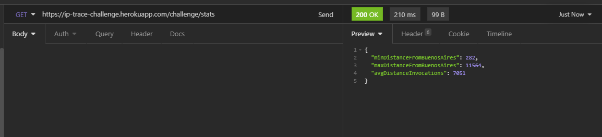
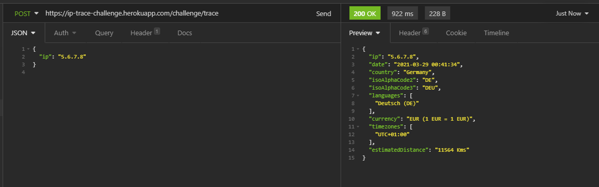

# Mercado Libre Backend Challenge

REST API solution for Mercado Libre backend challenge.

The service returns information about the geographic location, currency. In addition, it is possible to obtain statistical information of the invocations.

REST API Swagger information: https://ip-trace-challenge.herokuapp.com/swagger-ui.html

## Technology stack and plugins used

* [Spring Boot]("https://spring.io/projects/spring-boot")
* [Java SE 11 (LTS)]("https://www.oracle.com/java/technologies/javase-downloads.html)
* [InteliJ IDEA]("https://www.jetbrains.com/es-es/idea/")
* [Redis]("https://redis.io/")
* [PostgreSQL]("https://www.postgresql.org/")

## External dependencies

* [IP 2 Country]("https://ip2country.info/")
* [Fixer]("https://fixer.io/")
* [REST Countries]("https://restcountries.eu/")

## Installation

### Pre requisites

#### Redis

```bash
sudo apt-get install redis-server
```

#### PostgreSQL

Install PostgreSQL

```bash
$ sudo apt install postgresql postgresql-contrib
```

Create database with name `ip_trace`

### Running the application

Clone the repository

```bash
$ git clone https://github.com/scabrera05/meli-challenge.git
$ cd meli-challenge
```

Adjust `application.properties`

* Postgres database source
* Fixer service access key
* Redis server
* Set `spring.cache.type` value to `redis` to enable redis server caching. Set value to `none` to disable caching.

```properties
spring.datasource.username=${SPRING_DATASOURCE_USERNAME}
spring.datasource.password=${SPRING_DATASOURCE_PASSWORD}
fixerCurrencyService.accessKey=${FIXER_IO_ACCESS_KEY}
spring.cache.type=${CACHE_TYPE}
```

Run the application using the [Spring Boot Maven plugin]("https://docs.spring.io/spring-boot/docs/current/maven-plugin/reference/htmlsingle/")

```bash
$ mvn spring-boot:run
```

Alternatively import and run the solution from a suitable IDE.

## Examples of use

### Ping service

Health check endpoint. HTTP 200 OK status code returned

#### Request

`GET /challenge/ping`

    curl -i -H 'Accept: application/json' http://localhost:8080/challenge/ping

#### Response

    HTTP/1.1 200
    Content-Length: 0
    Date: Fri, 26 Mar 2021 23:43:02 GMT

### Statistics

#### Request

`GET /challenge/stats`

    curl -i -H 'Accept: application/json' http://localhost:8080/challenge/stats

#### Response

    HTTP/1.1 200
    Content-Type: application/json
    Transfer-Encoding: chunked
    Date: Fri, 26 Mar 2021 23:32:47 GMT
    
    {
        "minDistanceFromBuenosAires":282,
        "maxDistanceFromBuenosAires":11564,
        "avgDistanceInvocations":7193
    }

#### Example



### Trace IP

#### Request

`POST /challenge/trace`

    curl -X POST -H "Content-Type: application/json" -d "{ \"ip\": \"186.55.178.42\" }" http://localhost:8080/challenge/trace

#### Response

    {
        "ip": "186.55.178.42",
        "date": "2021-03-26 20:54:46",
        "country": "Uruguay",
        "isoAlphaCode2": "UY",
        "isoAlphaCode3": "URY",
        "languages": ["Español (ES)"],
        "currency": "UYU (1 EUR = 51.948573 UYU)",
        "timezones": ["UTC-03:00"],
        "estimatedDistance": "282 Kms"
    }

#### Example



## Improvements and TO-DO list

* Implement Unit Tests
* Allow https
