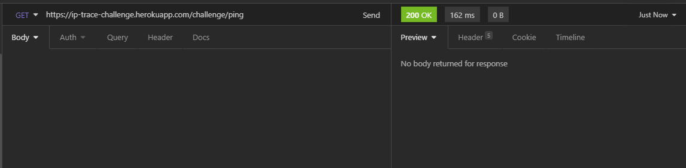

# Mercado Libre Backend Challenge

REST API solution for Mercado Libre backend challenge.

The service returns information about the geographic location, currency. In addition, it is possible to obtain statistical information of the invocations.

## Technology stack and plugins used

* [Spring Boot]("https://spring.io/projects/spring-boot")
* [Java SE 11]("https://www.oracle.com/java/technologies/javase-downloads.html)
* [InteliJ IDEA]("https://www.jetbrains.com/es-es/idea/")
* [Redis]("https://redis.io/")

## Installation

### Database configuration

COMPLETAR

### Redis

```bash
sudo apt-get install redis-server
```

### Running the application

Clone and run the application using the [Spring Boot Maven plugin]("https://docs.spring.io/spring-boot/docs/current/maven-plugin/reference/htmlsingle/")

    $ git clone https://github.com/scabrera05/meli-challenge.git
    $ cd meli-challenge
    $ mvn spring-boot:run

Alternatively import and run the solution from a suitable IDE.

## Examples of use

### Ping service

Health check endpoint. HTTP 200 OK status code returned

#### Request

`GET /challenge/ping`

    curl -i -H 'Accept: application/json' http://localhost:8080/challenge/ping

#### Response

    HTTP/1.1 200
    Content-Length: 0
    Date: Fri, 26 Mar 2021 23:43:02 GMT



### Statistics

#### Request

`GET /challenge/stats`

    curl -i -H 'Accept: application/json' http://localhost:8080/challenge/stats

#### Response

    HTTP/1.1 200
    Content-Type: application/json
    Transfer-Encoding: chunked
    Date: Fri, 26 Mar 2021 23:32:47 GMT
    
    {
        "minDistanceFromBuenosAires":282,
        "maxDistanceFromBuenosAires":11564,
        "avgDistanceInvocations":7193
    }


### Trace IP

#### Request

`POST /challenge/trace`

    curl -X POST -H "Content-Type: application/json" -d "{ \"ip\": \"186.55.178.42\" }" http://localhost:8080/challenge/trace

#### Response

    {
        "ip": "186.55.178.42",
        "date": "2021-03-26 20:54:46",
        "country": "Uruguay",
        "isoAlphaCode2": "UY",
        "isoAlphaCode3": "URY",
        "languages": ["Español (ES)"],
        "currency": "UYU (1 EUR = 51.948573 UYU)",
        "timezones": ["UTC-03:00"],
        "estimatedDistance": "282 Kms"
    }


## Improvements and TO-DO list

* Deploy app in Heorku
* Implement project Unit Tests
* Allow https